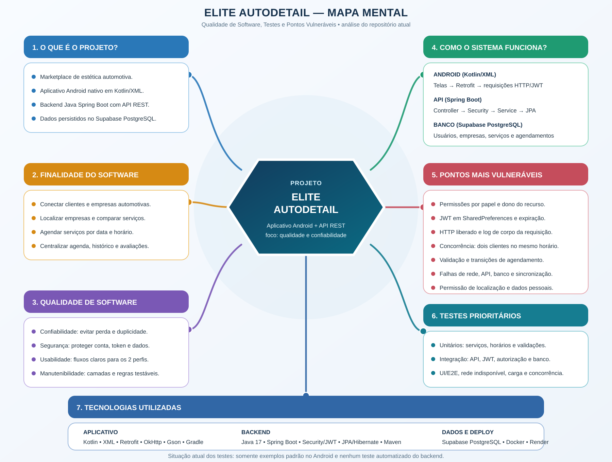

# Mapa Mental — Qualidade de Software e Testes

Este material foi elaborado a partir da estrutura e do código atuais do projeto **Marques AutoDetail**.

## Síntese para a atividade

### O que é o projeto?

O Marques AutoDetail é um marketplace de estética automotiva. O produto possui um aplicativo Android nativo em Kotlin/XML, uma API REST em Java com Spring Boot e persistência de dados no Supabase PostgreSQL.

### Qual é a finalidade do software?

O sistema aproxima clientes e empresas de estética automotiva. Ele permite encontrar empresas, consultar serviços, selecionar datas e horários, criar agendamentos, acompanhar o histórico, favoritar empresas e registrar avaliações. Para a empresa, oferece gerenciamento de perfil, serviços, horários e solicitações de agendamento.

### Como o sistema funciona?

1. O usuário interage com as telas do aplicativo Android.
2. O Retrofit envia requisições HTTP para a API, incluindo o token JWT quando existe uma sessão autenticada.
3. No backend, os Controllers recebem as requisições; o Spring Security e o filtro JWT autenticam o usuário; os Services executam as regras de negócio; e o Spring Data JPA acessa o banco.
4. O Supabase PostgreSQL armazena usuários, empresas, endereços, serviços, horários, agendamentos, favoritos e avaliações.
5. Há dois fluxos principais: **cliente**, que pesquisa e agenda serviços, e **empresa**, que administra serviços, disponibilidade e agendamentos.

### Quais tecnologias são utilizadas?

- **Aplicativo Android:** Kotlin, XML, Retrofit, OkHttp, Gson e Gradle.
- **Backend:** Java 17, Spring Boot, Spring Web, Spring Security, JWT, Spring Data JPA/Hibernate e Maven.
- **Banco de dados:** Supabase PostgreSQL.
- **Infraestrutura e deploy:** Docker e Render.

### Quais camadas ou funções são mais suscetíveis a falhas?

- **Autenticação e autorização:** conferir JWT inválido ou expirado, papel do usuário e propriedade do recurso. No código atual, algumas alterações dependem apenas de o usuário estar autenticado, sem validar claramente se ele é a empresa ou o cliente relacionado ao dado.
- **Sessão Android:** o token é armazenado em `SharedPreferences`; por isso, armazenamento, limpeza da sessão, backup do aplicativo e acesso ao aparelho precisam ser testados.
- **Comunicação com a API:** o manifesto permite tráfego HTTP sem criptografia para desenvolvimento e o interceptor registra o corpo completo das requisições. Em produção, isso pode expor credenciais, token ou dados pessoais se a configuração não for alterada.
- **Agendamentos e horários:** duas requisições simultâneas podem tentar reservar o mesmo horário. Também devem ser validadas as transições de estado, como confirmar, recusar, cancelar e concluir.
- **Validação de entrada:** cadastro, preço, duração, datas, horários, avaliações e identificadores precisam rejeitar valores vazios, inválidos ou inconsistentes.
- **Banco de dados:** falhas de conexão, variáveis de ambiente, divergência de esquema, constraints, transações e políticas RLS podem impedir a inicialização ou gerar inconsistência.
- **Rede e sincronização:** timeout, API indisponível, resposta malformada, `BASE_URL` incorreta e uso do repositório local temporário podem causar dados diferentes entre o aplicativo e o backend.
- **Localização e privacidade:** permissão negada, localização indisponível e tratamento de dados pessoais exigem fluxos alternativos e mensagens claras.
- **Interface e ciclo de vida Android:** rotação de tela, retomada do app, cliques repetidos e respostas assíncronas podem duplicar ações ou deixar a interface em estado incorreto.

## Situação atual dos testes

- O Android possui apenas os arquivos de exemplo gerados pelo projeto: um teste de soma (`2 + 2`) e um teste do nome do pacote.
- Não há testes automatizados do backend em `src/test`.
- O roteiro existente em `FECHAMENTO_PRODUTO.md` é um teste manual do fluxo principal, mas não substitui uma suíte automatizada.

## Testes prioritários recomendados

1. **Testes unitários:** `AuthService`, `HorarioService`, `AgendamentoService`, cálculo de conflito, validações e transições de status.
2. **Testes de integração:** endpoints com MockMvc, autenticação JWT, autorização por papel e dono do recurso, persistência e tratamento global de erros.
3. **Testes Android:** login, cadastro, armazenamento/remoção da sessão, mapeamento de respostas, permissões de localização e tratamento de erro de rede.
4. **Testes de interface e ponta a ponta:** fluxo cliente e fluxo empresa, inclusive confirmação, recusa e cancelamento.
5. **Testes de segurança:** token ausente/inválido/expirado, acesso cruzado entre contas, entradas malformadas, dados sensíveis em logs e exigência de HTTPS em produção.
6. **Testes de concorrência e desempenho:** criação simultânea de agendamentos para o mesmo horário e consulta de empresas, serviços e agenda sob carga.

## Critérios de qualidade usados

- **Confiabilidade:** manter dados corretos e evitar duplicidade de agendamentos.
- **Segurança:** proteger autenticação, autorização e dados pessoais.
- **Usabilidade:** oferecer fluxos claros e feedback de erro para cliente e empresa.
- **Desempenho:** responder adequadamente em consultas e reservas.
- **Manutenibilidade:** separar responsabilidades e criar testes que permitam alterar o sistema com segurança.
- **Compatibilidade:** funcionar em diferentes versões e estados do Android e em condições variadas de rede.
